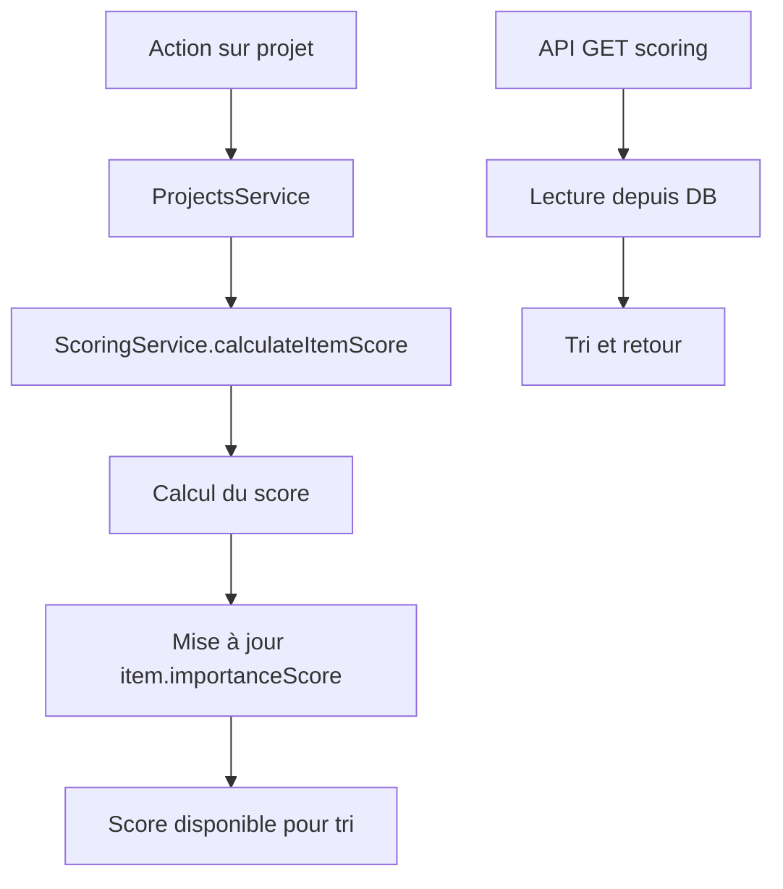

# 📊 Algorithme de Scoring d'Importance - ShelfSpot

## 📋 Table des matières

1. [Vue d'ensemble](#vue-densemble)
2. [Formule de calcul](#formule-de-calcul)
3. [Composants du score](#composants-du-score)
4. [Déclencheurs automatiques](#déclencheurs-automatiques)
5. [API et endpoints](#api-et-endpoints)
6. [Exemples pratiques](#exemples-pratiques)
7. [Architecture technique](#architecture-technique)
8. [Cas d'usage](#cas-dusage)

---

## 🎯 Vue d'ensemble

Le **système de scoring d'importance** de ShelfSpot permet de calculer automatiquement un score numérique pour chaque item de l'inventaire en fonction de son utilisation dans les projets actifs. Ce score aide à :

- **Prioriser les commandes** : Les items avec un score élevé sont plus critiques
- **Optimiser la gestion du stock** : Focus sur les items les plus importants
- **Anticiper les besoins** : Identifier les items critiques avant rupture de stock
- **Analyser l'impact** : Comprendre quels items bloquent le plus de projets

---

## 🧮 Formule de calcul

### Formule générale

```
Score Total = Score Projets Actifs + Score Projets en Pause + Bonus Multi-projets
```

### Détail des composants

```typescript
Score Projets Actifs = Σ(quantité_utilisée × multiplicateur_priorité)
Score Projets en Pause = Σ(quantité_utilisée × multiplicateur_priorité × 0.3)
Bonus Multi-projets = nombre_projets_actifs > 1 ? nombre_projets_actifs × 0.5 : 0
```

### Multiplicateurs de priorité

| Priorité   | Multiplicateur | Impact                            |
| ---------- | -------------- | --------------------------------- |
| `CRITICAL` | ×4.0           | Très critique, priorité absolue   |
| `HIGH`     | ×2.0           | Haute priorité                    |
| `MEDIUM`   | ×1.0           | Priorité normale (valeur de base) |
| `LOW`      | ×0.5           | Basse priorité                    |

---

## 🔧 Composants du score

### 1. Score des projets actifs (100% du poids)

- **Statut considérés** : `ACTIVE`
- **Calcul** : `quantité × multiplicateur_priorité`
- **Justification** : Les projets actifs ont un impact immédiat sur les besoins

### 2. Score des projets en pause (30% du poids)

- **Statut considérés** : `PAUSED`
- **Calcul** : `quantité × multiplicateur_priorité × 0.3`
- **Justification** : Les projets en pause peuvent reprendre, mais avec moins d'urgence

### 3. Bonus multi-projets

- **Calcul** : `nombre_projets_actifs > 1 ? nombre_projets_actifs × 0.5 : 0`
- **Justification** : Un item utilisé dans plusieurs projets est plus critique (diversification du risque)

### 4. Projets ignorés

- **Statuts ignorés** : `COMPLETED`, `CANCELLED`
- **Justification** : Ces projets n'ont plus d'impact sur les besoins futurs

---

## ⚡ Déclencheurs automatiques

### Recalcul automatique en temps réel

| Action                       | Moment             | Items affectés           | Méthode                                 |
| ---------------------------- | ------------------ | ------------------------ | --------------------------------------- |
| **Créer un projet**          | Après création     | Aucun (projet vide)      | -                                       |
| **Modifier statut projet**   | Immédiatement      | Tous les items du projet | `recalculateProjectItemsScores()`       |
| **Modifier priorité projet** | Immédiatement      | Tous les items du projet | `recalculateProjectItemsScores()`       |
| **Ajouter item au projet**   | Après ajout        | L'item ajouté            | `calculateItemScore()`                  |
| **Modifier quantité item**   | Après modification | L'item modifié           | `calculateItemScore()`                  |
| **Retirer item du projet**   | Après suppression  | L'item retiré            | `calculateItemScore()`                  |
| **Supprimer projet**         | Après suppression  | Tous les items du projet | `calculateItemScore()` pour chaque item |

### Code des déclencheurs

```typescript
// Dans ProjectsService
if (
  updateProjectDto.status !== undefined ||
  updateProjectDto.priority !== undefined
) {
  this.scoringService.recalculateProjectItemsScores(id).catch(console.error);
}

// Après modification d'item dans projet
this.scoringService
  .calculateItemScore(itemId)
  .then((scoreBreakdown) => {
    if (scoreBreakdown) {
      this.prisma.item
        .update({
          where: { id: itemId },
          data: { importanceScore: scoreBreakdown.totalScore },
        })
        .catch(console.error);
    }
  })
  .catch(console.error);
```

---

## 🔌 API et endpoints

### Endpoints de gestion des projets

```bash
# Gestion des projets
POST   /projects                    # Créer un projet
GET    /projects                    # Lister tous les projets
GET    /projects/:id                # Détails d'un projet
PATCH  /projects/:id                # Modifier un projet (recalcul auto)
DELETE /projects/:id                # Supprimer un projet (recalcul auto)

# Gestion des items dans les projets
POST   /projects/:id/items          # Ajouter un item (recalcul auto)
PATCH  /projects/:id/items/:itemId  # Modifier quantité (recalcul auto)
DELETE /projects/:id/items/:itemId  # Retirer un item (recalcul auto)
```

### Endpoints de scoring et statistiques

```bash
# Recalcul et statistiques
POST /projects/scoring/recalculate     # Recalcul complet de tous les scores
GET  /projects/scoring/statistics      # Statistiques globales des scores
GET  /projects/scoring/top-items       # Top 20 des items les plus importants
GET  /projects/scoring/critical-items  # Items critiques (score élevé + stock faible)

# Analyse par projet
GET /projects/:id/statistics           # Statistiques d'un projet
GET /projects/:id/scoring/breakdown    # Détail des scores des items du projet
```

### Réponses types

```typescript
// GET /projects/scoring/top-items
{
  "id": 42,
  "name": "Perceuse électrique",
  "quantity": 3,
  "importanceScore": 12.5,
  "status": "disponible",
  "room": { "name": "Atelier" },
  "place": { "name": "Étagère principale" }
}

// GET /projects/scoring/critical-items
{
  "id": 15,
  "name": "Vis inox M6",
  "quantity": 2,                    // Stock faible
  "importanceScore": 8.0,           // Score élevé
  "criticalityRatio": 4.0,          // 8.0 / 2 = très critique
  "status": "disponible"
}
```

---

## 💡 Exemples pratiques

### Exemple 1 : Item dans un seul projet

```
Item : "Marteau"
Projet A (ACTIVE, HIGH priority) : 1 unité

Calcul :
- Score projets actifs = 1 × 2.0 = 2.0
- Score projets en pause = 0
- Bonus multi-projets = 0 (un seul projet)
- Score total = 2.0
```

### Exemple 2 : Item dans plusieurs projets

```
Item : "Perceuse"
Projet A (ACTIVE, CRITICAL priority) : 2 unités
Projet B (ACTIVE, MEDIUM priority) : 1 unité
Projet C (PAUSED, HIGH priority) : 3 unités

Calcul :
- Score projets actifs = (2 × 4.0) + (1 × 1.0) = 9.0
- Score projets en pause = (3 × 2.0 × 0.3) = 1.8
- Bonus multi-projets = 2 projets actifs × 0.5 = 1.0
- Score total = 9.0 + 1.8 + 1.0 = 11.8
```

### Exemple 3 : Évolution du score

```
État initial :
Item "Scie" dans Projet A (ACTIVE, HIGH) : 1 unité
Score = 1 × 2.0 = 2.0

Action : Changement de priorité Projet A → CRITICAL
Nouveau score = 1 × 4.0 = 4.0 (recalculé automatiquement)

Action : Ajout dans Projet B (ACTIVE, MEDIUM) : 2 unités
Nouveau score = (1 × 4.0) + (2 × 1.0) + (2 × 0.5) = 7.0
```

---

## 🏗️ Architecture technique

### Services impliqués

#### ScoringService (`src/scoring/scoring.service.ts`)

- **Responsabilité** : Calculs de scores et statistiques
- **Méthodes principales** :
  - `calculateItemScore(itemId)` : Calcul pour un item
  - `calculateAllItemsScores()` : Recalcul complet
  - `recalculateProjectItemsScores(projectId)` : Recalcul d'un projet
  - `getTopImportanceItems()` : Top des items importants
  - `getCriticalItems()` : Items critiques

#### ProjectsService (`src/projects/projects.service.ts`)

- **Responsabilité** : Gestion des projets et déclenchement des recalculs
- **Intégration** : Appelle `ScoringService` automatiquement

#### ItemsService (`src/items/items.service.ts`)

- **Responsabilité** : Gestion des items
- **Intégration** : Peut utiliser `ScoringService` pour le tri

### Base de données

#### Table `Project`

```sql
id          INT PRIMARY KEY
name        VARCHAR UNIQUE
description TEXT
status      ENUM('ACTIVE', 'COMPLETED', 'PAUSED', 'CANCELLED')
priority    ENUM('LOW', 'MEDIUM', 'HIGH', 'CRITICAL')
startDate   DATETIME
endDate     DATETIME
createdAt   DATETIME
updatedAt   DATETIME
```

#### Table `ProjectItem` (table de liaison)

```sql
id         INT PRIMARY KEY
projectId  INT FOREIGN KEY
itemId     INT FOREIGN KEY
quantity   INT DEFAULT 1
isActive   BOOLEAN DEFAULT TRUE
createdAt  DATETIME
updatedAt  DATETIME

UNIQUE KEY (projectId, itemId)
```

#### Table `Item` (propriété ajoutée)

```sql
-- Propriété ajoutée
importanceScore FLOAT DEFAULT 0

-- Index pour optimiser les tris
INDEX idx_importance_score (importanceScore)
```

### Flux de données



---

## 🎯 Cas d'usage

### 1. Priorisation des commandes

```typescript
// Obtenir les items les plus critiques à recommander
const criticalItems = await scoringService.getCriticalItems(5);
// Retourne les items avec score élevé mais stock ≤ 5
```

### 2. Dashboard de gestion

```typescript
// Statistiques globales pour le dashboard admin
const stats = await scoringService.getScorignStatistics();
/*
{
  totalItems: 150,
  itemsWithScore: 45,
  averageScore: 3.2,
  maxScore: 15.8,
  distribution: {
    critical: 5,  // Score > 10
    high: 12,     // Score 5-10
    medium: 20,   // Score 1-5
    low: 8,       // Score 0.1-1
    zero: 105     // Score = 0
  }
}
*/
```

### 3. Analyse d'impact de projet

```typescript
// Voir l'impact d'un projet sur les scores
const breakdown =
  await projectsController.getProjectScoringBreakdown(projectId);
// Retourne le détail des scores de tous les items du projet
```

### 4. Tri intelligent des items

```typescript
// Option A : Endpoints dédiés (recommandé)
const topItems = await scoringService.getTopImportanceItems(20);

// Option B : Modifier ItemsService pour tri par défaut
async findAll() {
  return this.prisma.item.findMany({
    orderBy: { importanceScore: 'desc' }, // Tri par importance
    include: { /* ... */ }
  });
}
```

### 5. Alertes intelligentes

```typescript
// Combiner alertes stock + score d'importance
const alertsWithPriority = alerts.map((alert) => ({
  ...alert,
  priority: alert.item.importanceScore > 10 ? 'CRITICAL' : 'NORMAL',
}));
```

---

## 📈 Performances et optimisations

### Index de base de données

```sql
-- Index pour tri par score (déjà présent)
ALTER TABLE Item ADD INDEX idx_importance_score (importanceScore);

-- Index pour requêtes de projets actifs
ALTER TABLE Project ADD INDEX idx_status_priority (status, priority);

-- Index pour liaison projet-item
ALTER TABLE ProjectItem ADD INDEX idx_project_active (projectId, isActive);
```

### Mise en cache (recommandations futures)

- Cache Redis pour les top items (TTL: 1h)
- Cache des statistiques globales (TTL: 30min)
- Invalidation automatique lors des modifications

### Monitoring

- Log des recalculs de scores
- Métriques de performance des calculs
- Alertes si recalcul prend trop de temps

---

## 🔄 Évolutions futures possibles

### Algorithme

- **Facteur temps** : Pénaliser les projets proches de leur deadline
- **Facteur coût** : Intégrer le prix des items dans le calcul
- **Historique** : Utiliser les données de consommation passée
- **Saisonnalité** : Adapter selon les périodes de l'année

### Fonctionnalités

- **Suggestions automatiques** : "Items à commander en priorité"
- **Prédictions** : "Stock épuisé dans X jours selon les projets"
- **Optimisation** : "Réorganiser les items par importance"
- **Rapports** : Export Excel des analyses de criticité

---

## 📚 Références techniques

### Fichiers sources

- `src/scoring/scoring.service.ts` - Logique de calcul
- `src/projects/projects.service.ts` - Déclencheurs automatiques
- `src/projects/projects.controller.ts` - API endpoints
- `prisma/schema.prisma` - Modèle de données
- `src/projects/dto/project.dto.ts` - Types et validation

### Dépendances

- Prisma ORM pour l'accès aux données
- NestJS pour l'architecture modulaire
- class-validator pour la validation des DTOs
- Swagger pour la documentation API

---

_Documentation générée pour ShelfSpot v1.0 - Système de gestion d'inventaire intelligent_
